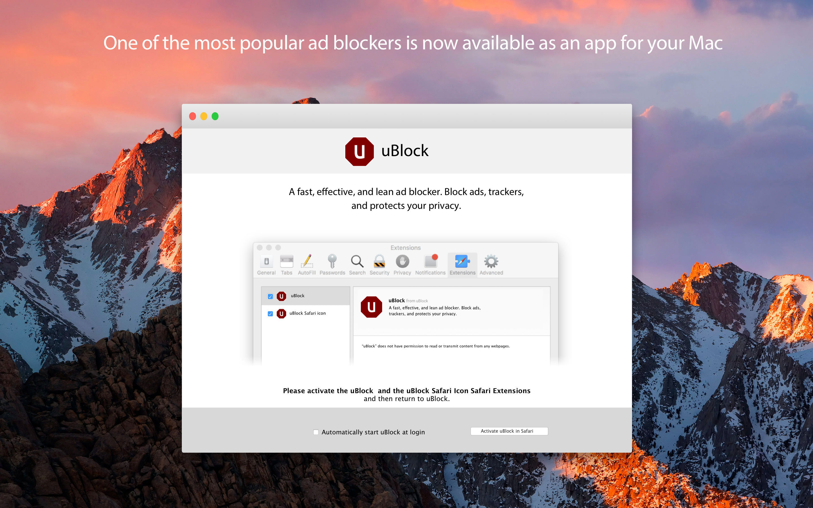
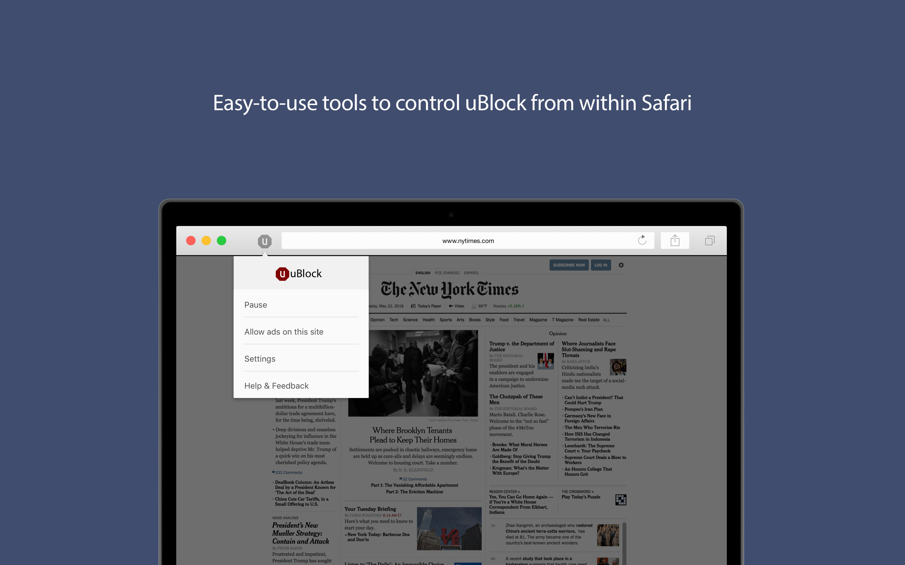

# uBlock for Mac

uBlock is a general-purpose content blocker, which means it can be used to block ads as well as other forms of content on webpages. uBlock can also be used to help users neutralize privacy-invading trackers. The uBlock Mac app, also called a Safari app extension by Apple, is available for download on the [homepage](https://www.ublock.org/macOS/) or in the [App Store](https://itunes.apple.com/us/app/ublock/id1385985095?ls=1&mt=8). The uBlock Mac app will be the preferred product for blocking ads in Safari in light of [recent news from Apple](https://developer.apple.com/safari/whats-new/) that it will be deprecating legacy extensions.

### Screenshots

### Releases
Latest released version: 1.2

### Installation
The preferred method of installation is to install from the [App Store](https://itunes.apple.com/us/app/ublock/id1385985095?ls=1&mt=8).

Compatible with OS X 10.12 and later.

### License
[GPLv3](LICENSE.txt)
